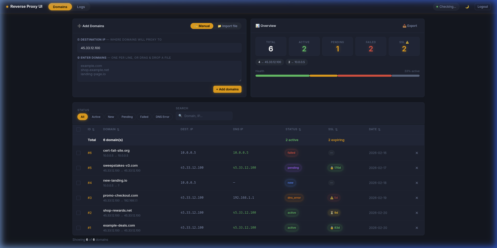

# Reverse Proxy UI Pro

A modern web dashboard for managing Nginx reverse proxy domains, SSL certificates, and configurations — all from a sleek dark-themed interface.



## ✨ Features

- **Dark / Light theme** with neon glow design and smooth toggle
- **SSL certificate tracking** — expiry badges (🔒 OK / ⏳ expiring / ⚠️ critical)
- **Auto-status detection** via DNS resolution (active / dns_error / pending)
- **Inline editing** — double-click IP cells to edit in place
- **Column sorting** — click any header to sort (ID, Domain, Status, SSL, Date)
- **Status filters** — All, Active, New, Pending, Failed, DNS Error
- **Search** — instant filter by domain name or IP
- **Add Domains** — tabbed interface:
  - **Manual** — textarea with live domain counter
  - **Import file** — drag & drop .txt/.csv with preview (✓ valid / ✗ invalid)
- **Export CSV** — one-click download of all domains
- **Health bar** — visual overview of domain fleet status
- **IP grouping** — see how many domains point to each IP
- **Favicon badge** — shows failed domain count in browser tab
- **Confirm delete** — lists domain names before deletion
- **Auto-refresh** — updates every 30 seconds
- **Skeleton loading** — smooth loading placeholders
- **Row animations** — staggered fade-in effects
- **Responsive** — mobile card layout for screens < 768px

## 🚀 Quick Start

```bash
git clone https://github.com/AndrejGorodnij/reverse-proxy-ui-pro.git
cd reverse-proxy-ui-pro
chmod +x start.sh
./start.sh
```

The script will:
1. Generate a random password
2. Build and start Docker containers
3. Print login credentials to `credentials.txt`

The script will prompt you to select an installation mode:
- **1) webui** — standard web dashboard (password login)
- **2) api** — external API only (API key auth)
- **3) webui+api** — both interfaces enabled

Access the dashboard at **http://your-server-ip**

## 🔑 External API Usage (API Mode)

If you enabled the API during setup, you can manage domains programmatically using the `X-API-Key` header (the key is saved in `credentials.txt`):

```bash
# List domains
curl -H "X-API-Key: YOUR_API_KEY" http://your-server-ip/api.php?_path=domains

# Add multiple domains
curl -X POST -H "X-API-Key: YOUR_API_KEY" -H "Content-Type: application/json" \
  -d '{"names":["api-test.com", "another.io"], "ip":"1.2.3.4"}' \
  http://your-server-ip/api.php?_path=domains

# Check Nginx status
curl -H "X-API-Key: YOUR_API_KEY" http://your-server-ip/api.php?_path=status
```

## 🐳 Docker Architecture

| Service | Description |
|---------|-------------|
| `reverse-proxy` | Nginx reverse proxy with auto-generated SSL configs |
| `webui` | PHP 8.0-FPM backend with SQLite + Certbot |

## 📁 Project Structure

```
├── docker-compose.yml        # Service definitions
├── nginx-configs/default.conf # Nginx SPA config
├── reverse-proxy.Dockerfile   # Nginx image
├── webui.Dockerfile           # PHP-FPM + Certbot image
├── start.sh                   # Setup & launch script
└── src/
    ├── www/
    │   ├── index.html          # SPA frontend
    │   ├── api.php             # API router
    │   ├── assets/
    │   │   ├── app.js          # Frontend logic (740+ lines)
    │   │   └── style.css       # Themes & responsive styles
    │   └── database/
    │       ├── db.php           # SQLite singleton
    │       ├── crud/            # Domain CRUD endpoints
    │       └── config/          # Generate, restart, status
    └── nginx-templates/        # Vhost template
```

## 🔌 API Endpoints

| Method | Path | Description |
|--------|------|-------------|
| POST | `/api.php?_path=login` | Authenticate |
| GET | `/api.php?_path=auth/check` | Check session |
| POST | `/api.php?_path=logout` | Logout |
| GET | `/api.php?_path=domains` | List all domains |
| POST | `/api.php?_path=domains` | Add domains (batch) |
| POST | `/api.php?_path=domains/delete` | Delete domains |
| POST | `/api.php?_path=domains/update` | Update domain (inline edit) |
| POST | `/api.php?_path=domains/generate` | Generate SSL + configs (SSE) |
| POST | `/api.php?_path=domains/restart` | Restart Nginx |
| GET | `/api.php?_path=status` | Check Nginx status |

## 🙏 Credits

Forked from [momentum100/reverse-proxy-ui](https://github.com/momentum100/reverse-proxy-ui) — the original lightweight reverse proxy manager.

## 📄 License

MIT

---

# Reverse Proxy UI Pro (Українською)

Сучасна веб-панель для керування доменами Nginx reverse proxy, SSL-сертифікатами та конфігураціями — з елегантним темним дизайном.

## ✨ Можливості

- **Темна / світла тема** з неоновим свіченням та плавним перемиканням
- **Відстеження SSL-сертифікатів** — бейджі терміну дії (🔒 OK / ⏳ спливає / ⚠️ критично)
- **Автоматичне визначення статусу** через DNS (active / dns_error / pending)
- **Редагування в рядку** — подвійний клік по IP для зміни
- **Сортування колонок** — клік по заголовку (ID, Домен, Статус, SSL, Дата)
- **Фільтри статусу** — Всі, Active, New, Pending, Failed, DNS Error
- **Пошук** — миттєва фільтрація за доменом або IP
- **Додавання доменів** — інтерфейс з вкладками:
  - **Вручну** — textarea з лічильником доменів
  - **Імпорт файлу** — drag & drop .txt/.csv з попереднім переглядом (✓ валідні / ✗ невалідні)
- **Експорт CSV** — завантаження всіх доменів одним кліком
- **Health bar** — візуальний огляд стану всіх доменів
- **Групування по IP** — скільки доменів на кожному IP
- **Бейдж у favicon** — кількість проблемних доменів у вкладці браузера
- **Підтвердження видалення** — список доменів перед видаленням
- **Авто-оновлення** — кожні 30 секунд
- **Skeleton loading** — плавні заглушки під час завантаження
- **Анімації рядків** — послідовна поява з ефектом fade-in
- **Адаптивність** — карточний вигляд для мобільних (< 768px)

## 🚀 Швидкий старт

```bash
git clone https://github.com/AndrejGorodnij/reverse-proxy-ui-pro.git
cd reverse-proxy-ui-pro
chmod +x start.sh
./start.sh
```

Скрипт:
1. Згенерує випадковий пароль
2. Збере та запустить Docker-контейнери
3. Запише дані для входу в `credentials.txt`

Під час запуску скрипт запропонує вибрати режим:
- **1) webui** — стандартна веб-панель (вхід за паролем)
- **2) api** — тільки зовнішній API (авторизація за токеном)
- **3) webui+api** — увімкнені обидва інтерфейси

Відкрийте панель за адресою **http://ваш-сервер-ip**

## 🔑 Використання зовнішнього API

Якщо API активовано, ви можете керувати доменами програмно, використовуючи заголовок `X-API-Key` (токен зберігається у `credentials.txt`):

```bash
# Отримати список доменів
curl -H "X-API-Key: YOUR_API_KEY" http://ваш-сервер-ip/api.php?_path=domains

# Додати домени
curl -X POST -H "X-API-Key: YOUR_API_KEY" -H "Content-Type: application/json" \
  -d '{"names":["api-test.com", "another.io"], "ip":"1.2.3.4"}' \
  http://ваш-сервер-ip/api.php?_path=domains
```

## 🙏 Подяки

Форк оригінального проєкту [momentum100/reverse-proxy-ui](https://github.com/momentum100/reverse-proxy-ui).
